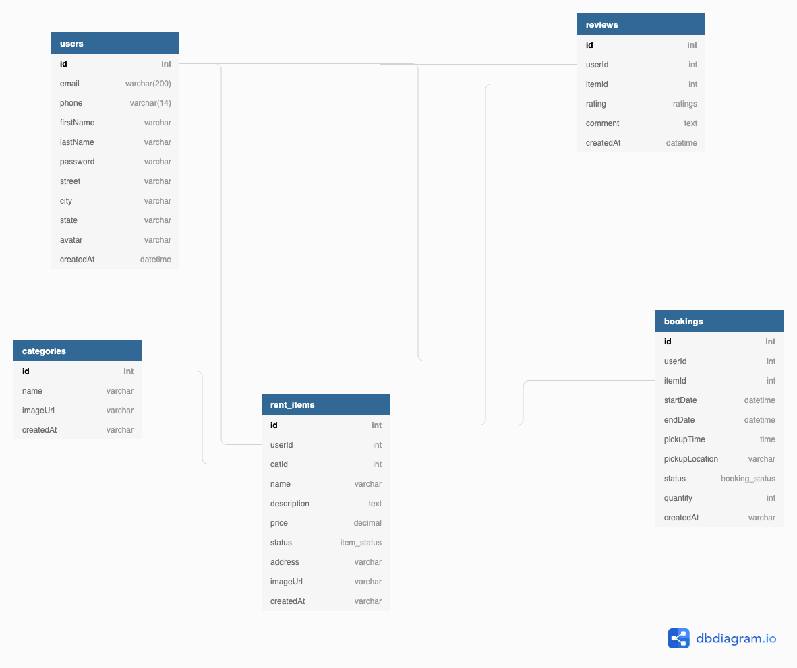

# Use My Tech Stuff
 💥🔥📷📺💻🏠⑁ 🔥💥

 UMTS [Use My Tech Stuff] is a platform for connecting users in need of renting equipment/properties with the users willing to rent out same. It eliminates the overhead cost due to middlemen in renting equipment or properties.

  

# Api Docs

> BASE_URL : https://umts-backend.herokuapp.com/api/

> [Link to the API documentation](https://documenter.getpostman.com/view/4448465/SVYkw1n2?version=latest)

# Schematic Design
[Link to the design](https://dbdiagram.io/d/5d3b6006ced98361d6dd0bcc)

# Endpoints Summary

| Verb | Route | Description | Auth Required |
|------|-------|-------------|---------------|
|   GET   |  /      |   Index Route          |   false            |
|   POST   |  `/auth/register`      |    Create account          |      false         |
|  POST    |  `/auth/login`      |   Sign in          |   false            |
|   PUT   |   `/auth/profile`    |    Update Profile         |      true        |
|   GET   |   `/rentItems`    |     Get list of rent items        |    false           |
|   GET   |  `/rentItems/:itemId`     | Get single item            |    false           |
|   PUT   |  `/rentItems/:itemId`     |    Update an item         |   true            |
|   DELETE   |  `/rentItems/:itemId`     |   Delete item          |   true            |
|   GET   |  `/rentItems/:catId/categories/`     |   Get items under a category          |  false             |
|   GET   | `/categories`     |     Get List of item categories        |    false           |
|  POST    |  `/categories`  |  Create a category           |    true           |
|   POST   |  `/rentItems/1/reviews`     |   Add Review to an item          |    true           |
|  POST    |   `/rentItems/1/bookings`    |  rent an item           |  true             |
|   GET   |  `/auth/users/:userId`     |  Get single user details           |  true             |

# Usage  
## Requirements
  > Node installed

  > NPM or Yarn install

  ## Steps
  - `git clone https://github.com/build-week-use-my-tech-stuff-umts/umts-backend.git && cd umts-backend`
  - `touch .env && cp .env.example .env`
  - `npm install`
  - `npm run migrate && npm run seed`
  - `npm run start:dev`

## Test
> npm test

# Framework/libraries
- [Express](https://expressjs.com/) 
- [Sequelize ORM](https://sequelize.org/)/[node postgress](https://www.npmjs.com/package/pg) for database client
- [Express validator](http://exss-validator.github.io/docs)  for validation
- [Express Error Bouncer](https://www.npmjs.com/package/express-error-bouncer) for central error handling
- [Bcrypt](https://www.npmjs.com/package/bcrypt) for password encryption
- [Jsonwebtoken](https://www.npmjs.com/package/jsonwebtoken) for Authentication

# Test libraries
- [Jest](https://jestjs.io/docs)
- [Supertest](https://www.npmjs.com/package/supertest)

# Tools
- [Eslint]() for style guide and linting
- [Postgreql](https://www.postgresql.org/) for database

- [Travis](https://travis-ci.org/build-week-use-my-tech-stuff-umts) for CI/CD
- [Coveralls](https://coveralls.io/github/build-week-use-my-tech-stuff-umts/umts-backend) for coverage test.
- [dbdiagram.io](https://dbdiagram.io/) for database schema design
- [Heroku](https://heroku.com/) for hosting

# Licence
- MIT 
